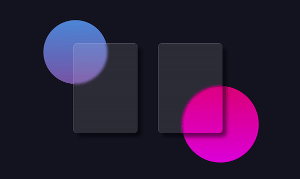

## 30diasDeCSS 

Já vi esse desafio antes mas sempre tive medo de tentar, não conseguir finalizar e me sentir mal depois kkkk Agora decidi tentar pois estou a um tempo sem estudar e isso vai me ajudar psicologicamente a voltar e ainda vou aprender umas coisinhas novas de CSS. 

### :: Objetivo ::

De 2 de Fevereiro a 3 de março, um mini-projeto de CSS/HTML por dia. Se eu continuar tranquilo, consigo finalizar no dia do meu aniversário, então me darei um presente ashuahshauhs.

***A ideia desse desafio é da [Milena Carecho](https://github.com/MilenaCarecho/30diasDeCSS), vê por lá também que tá mais organizado***

* [Dia 1 - Ícones em camadas](#id01)
* [Dia 2 - Loadings animados](#id02)
* [Dia 3 - Texto que muda de cor](#id03)
* [Dia 4 - Botão com efeito](#id04)
* [Dia 5 - Efeito de pulsar](#id05)
* [Dia 6 - Efeito de Luz](#id06)
* [Dia 7 - Loading animado](#id07)  
* [Dia 8 - Coração batendo](#id08)
* [Dia 9 - Pendulo de Newton](#id09)
* [Dia 10 - Letras flutuantes](#id10)
* [Dia 11 - Botoẽs com efeito](#id11)
* [Dia 12 - Óculos](#id12)
* [Dia 13 - Animação](#id13)
* [Dia 14 - Nuvens](#id14)
* [Dia 15 - Sistema solar simple](#id15)
* [Dia 16 - Relógio](#id16)
* [Dia 17 - Hover cards](#id17)
* [Dia 18 - Navigation com efeito](#id18)
* [Dia 19 - Glassmorphism](#id19)
* [Dia 20 - Imagem em texto](#id20)
* [Dia 21 - Esferas quicando](#id21)
* [Dia 22 - Icones com efeito](#id22)
* [Dia 23 - Botão com efeito hover](#id23)
<!-- * [Dia 24 - Preloader animado](#id24)
* [Dia 25 - Checkbox animado](#id25)
* [Dia 26 - Loading com efeito](#id26)
* [Dia 27 - Efeito pulsar](#id27)
* [Dia 28 - Cor do background mudando](#id28)
* [Dia 29 - Menu responsivo com Media Queries](#id29)
* [Dia 30 - Fogos de artificio](#id30) -->

<!-- https://youtu.be/GEDNdp4g--E ultimo dia -->

### Dia 1 - Ícone em camadas 

  

### Dia 2 - Loadings animados 

  

### Dia 3 - Texto que muda de cor 

  

 
### Dia 4 - Botão com efeito 

  

### Dia 5 - Efeito de pulsar 

  

### Dia 6 - Efeito de Luz 

  

### Dia 7 - Loading animado 

  

### Dia 8 - Coração batendo 

  

### Dia 9 - Pêndulos 

  

### Dia 10 - Letras flutuantes 

  

### Dia 11 - Botões com efeito 

  

### Dia 12 - Óculos com Css 

  

### Dia 13 - Animação com luz e sombra 

  

### Dia 14 - Nuvens 

  

### Dia 15 - Sistema solar simples 

  

### Dia 16 - Relógio 

  

### Dia 17 - Hover cards 

  

### Dia 18 - Navigation com efeito 

  

### Dia 19 - Glassmorphism 

  

### Dia 20 - Imagem em texto 

  

### Dia 21 - Styled Radio Button 

  

### Dia 22 - Mobile Navigation 

  

### Dia 23 - Styled Checkbox 

  

